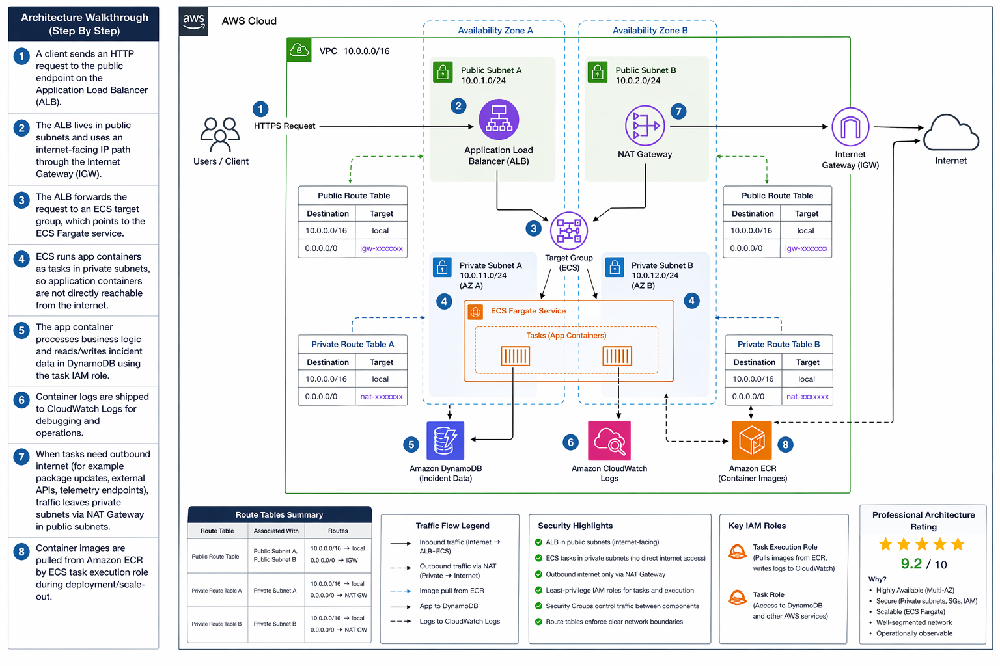
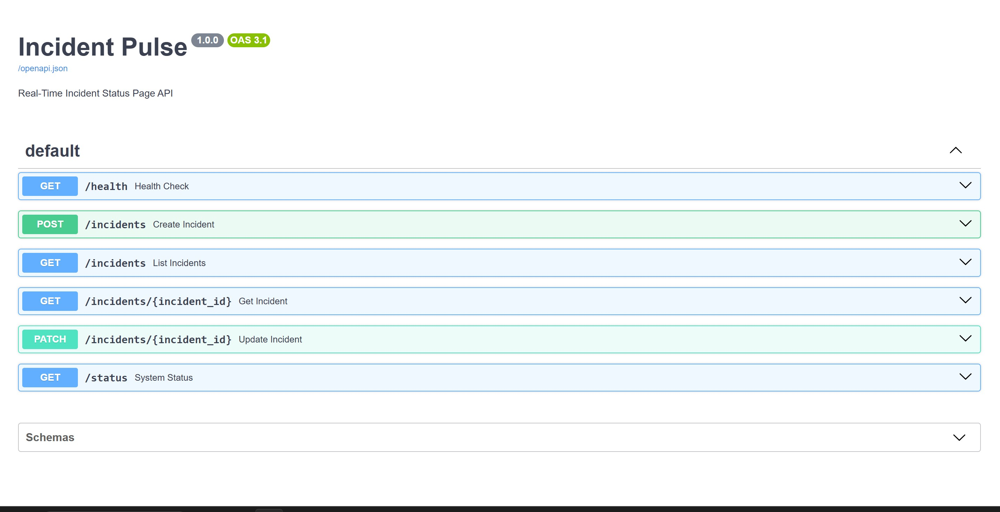
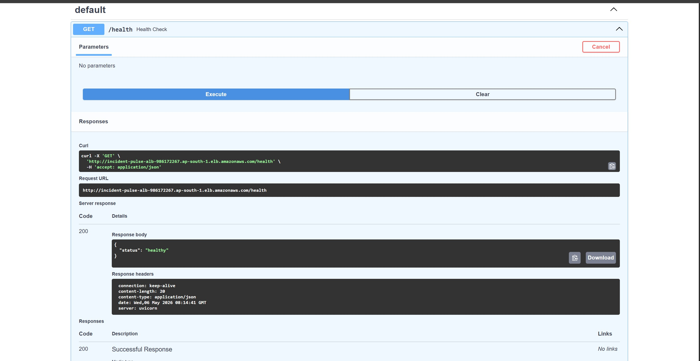
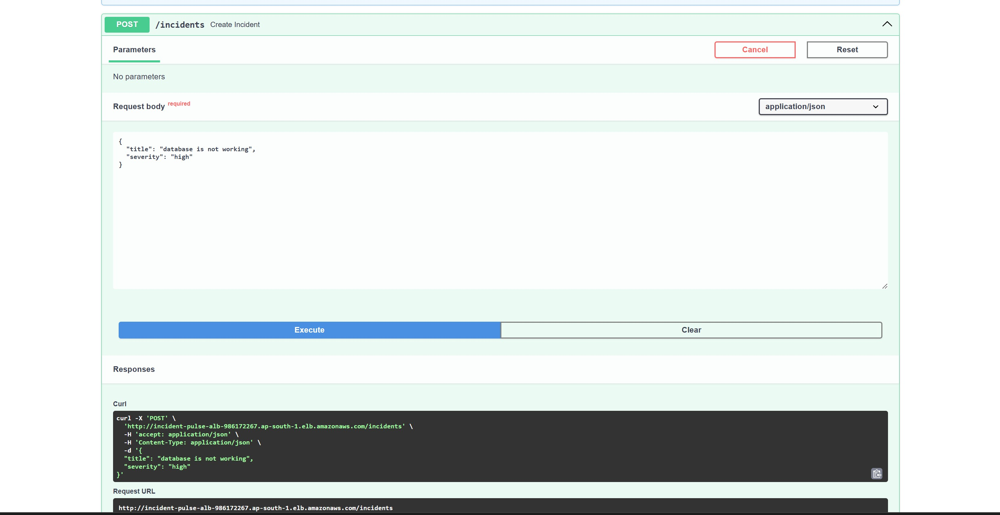
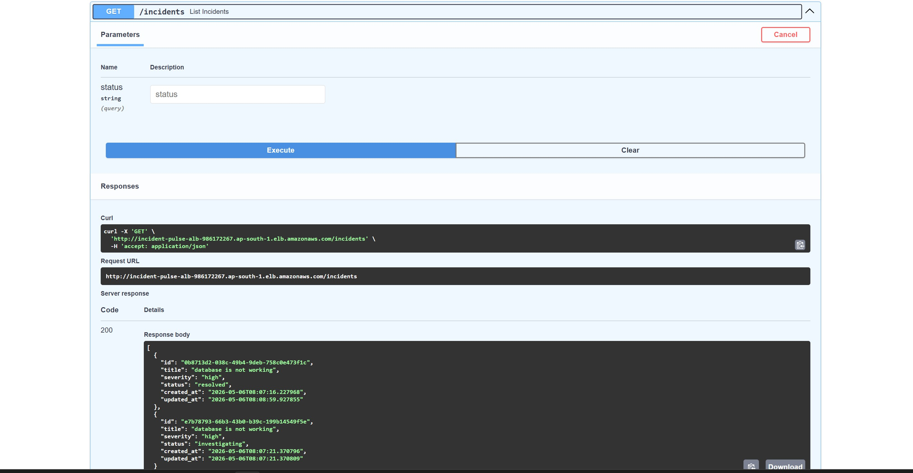
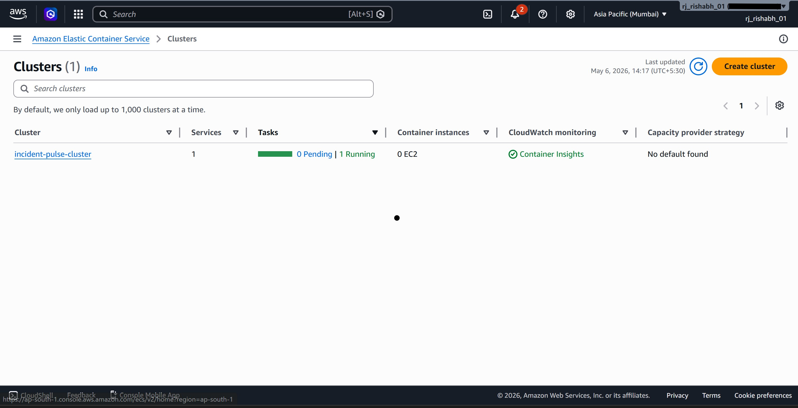
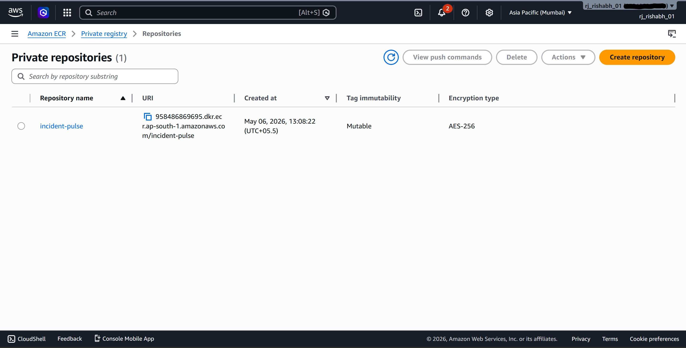
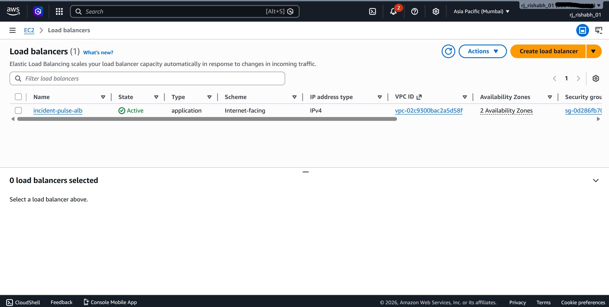
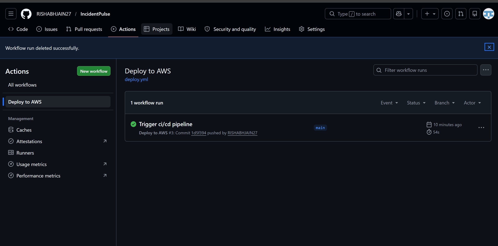

# Incident Pulse

A real-time incident status page API built with Python and FastAPI, deployed on AWS ECS Fargate using Terraform for infrastructure, GitHub Actions for CI/CD, and CloudWatch for monitoring.

---

## Architecture



### Request Flow

1. A user sends an HTTP request to the public endpoint on the Application Load Balancer (ALB).
2. The ALB lives in public subnets and uses an internet-facing IP path through the Internet Gateway (IGW). It forwards the request to an ECS target group, which points to the ECS Fargate service.
3. ECS runs application containers as tasks in private subnets, so containers are not directly reachable from the internet.
4. The app container processes business logic and reads/writes incident data in DynamoDB using the task IAM role.
5. Container logs are shipped to CloudWatch Logs for debugging and operations.
6. When containers need outbound internet access (for example, pulling images during deployment), traffic leaves private subnets via the NAT Gateway in public subnets.
7. Container images are pulled from Amazon ECR by the ECS task execution role during deployment and scale-out.

---

## Tech Stack

| Layer | Tool |
|-------|------|
| App | Python, FastAPI |
| Database | Amazon DynamoDB |
| Containerization | Docker |
| Compute | AWS ECS Fargate |
| Networking | VPC, ALB, Security Groups |
| IaC | Terraform |
| CI/CD | GitHub Actions |
| Registry | Amazon ECR |
| Monitoring | Amazon CloudWatch, SNS |
| Security | IAM Roles & Policies |

---

## Features

### API Features

- **Create Incident** — log a new incident with a title and severity level
- **List Incidents** — retrieve all incidents, with optional status filtering
- **Get Incident** — fetch a single incident by ID
- **Update Incident** — update the status of an existing incident
- **System Status** — view overall system health based on active incidents
- **Health Check** — verify the API is running and responsive

### DevOps Features

- **Containerized** — application packaged as a Docker image for consistent deployments
- **Infrastructure as Code** — all AWS resources defined in Terraform across 7 modules (networking, ECR, IAM, ALB, DynamoDB, ECS, monitoring)
- **Automated CI/CD** — GitHub Actions pipeline builds, pushes to ECR, and deploys to ECS on every push to main
- **Monitoring & Alerting** — CloudWatch alarm triggers SNS email notification when running tasks drop to zero
- **Centralized Logging** — container logs shipped to CloudWatch Logs with 7-day retention
- **Security Best Practices** — containers run in private subnets, least-privilege IAM policies, security groups restrict traffic between layers

---

## Screenshots

### Swagger UI — Interactive API Documentation


### Health Check Endpoint


### Create Incident


### List Incidents


### AWS ECS — Running Service


### AWS ECR — Container Registry


### AWS ALB — Load Balancer


### CI/CD Pipeline — GitHub Actions


---

## Project Structure

```
IncidentPulse/
├── .github/workflows/
│   └── deploy.yml            # CI/CD pipeline
├── app/
│   ├── main.py               # FastAPI application and routes
│   ├── models.py             # Pydantic models and enums
│   ├── database.py           # DynamoDB operations
│   └── config.py             # Environment configuration
├── terraform/
│   ├── main.tf               # Root module — wires all modules together
│   ├── variables.tf          # Root variables
│   ├── backend.tf            # S3 remote state configuration
│   ├── provider.tf           # AWS provider setup
│   └── modules/
│       ├── networking/       # VPC, subnets, IGW, NAT, route tables
│       ├── ecr/              # Container registry
│       ├── iam/              # Task execution and task roles
│       ├── alb/              # Load balancer, target group, listener
│       ├── dynamodb/         # Incidents table
│       ├── ecs/              # Cluster, task definition, service
│       └── monitoring/       # CloudWatch logs, alarms, SNS
├── tests/
│   └── test_main.py          # API tests with mocked DynamoDB
├── Dockerfile                # Container image definition
├── requirements.txt          # Python dependencies
└── .gitignore
```

---

## Run Locally

### Prerequisites
- Python 3.12
- Docker Desktop
- DynamoDB Local (for local development)

### Steps

```bash
# Clone the repo
git clone https://github.com/RISHABHJAIN27/IncidentPulse.git
cd IncidentPulse

# Create virtual environment
python -m venv venv
source venv/bin/activate        # Linux/Mac
venv\Scripts\activate           # Windows

# Install dependencies
pip install -r requirements.txt

# Start DynamoDB Local
docker run -d -p 8001:8000 amazon/dynamodb-local

# Create the local table
python db_check.py

# Run the app
uvicorn app.main:app --reload --port 8000
```

Visit `http://localhost:8000/docs` to access the Swagger UI.

---

## Deploy to AWS

### Prerequisites
- AWS CLI configured with valid credentials
- Terraform installed
- Docker Desktop running

### Steps

```bash
# Navigate to terraform directory
cd terraform

# Create a terraform.tfvars file with your email
echo 'alert_email = "your@email.com"' > terraform.tfvars

# Initialize and deploy infrastructure
terraform init
terraform apply

# The CI/CD pipeline handles the rest —
# push any change to main and GitHub Actions will:
# 1. Build the Docker image
# 2. Push to ECR
# 3. Update the ECS service
git add .
git commit -m "Deploy"
git push origin main
```

### Tear Down

```bash
terraform destroy
```

---

## CI/CD Pipeline

The GitHub Actions workflow (`.github/workflows/deploy.yml`) runs on every push to `main`:

```
Push to main → Checkout code → Configure AWS → Login ECR → Build & Push image → Update ECS
```

**Required GitHub Secrets:**
- `AWS_ACCESS_KEY_ID`
- `AWS_SECRET_ACCESS_KEY`
- `AWS_REGION`
- `ECS_CLUSTER_NAME`
- `ECS_SERVICE_NAME`

---

## Monitoring & Alerting

- **CloudWatch Logs** — all container logs are shipped to `/ecs/incident-pulse` with 7-day retention
- **CloudWatch Alarm** — triggers when ECS running task count drops below 1
- **SNS Notification** — alarm sends an email alert so you know immediately when the service is down

---

## API Endpoints

| Method | Endpoint | Description |
|--------|----------|-------------|
| GET | `/health` | Health check |
| POST | `/incidents` | Create a new incident |
| GET | `/incidents` | List all incidents (optional status filter) |
| GET | `/incidents/{id}` | Get a specific incident |
| PATCH | `/incidents/{id}` | Update incident status |
| GET | `/status` | System status overview |

---

## Author

**Rishabh Jain**

Built as a hands-on DevOps portfolio project to demonstrate end-to-end cloud infrastructure, containerization, CI/CD automation, and monitoring.